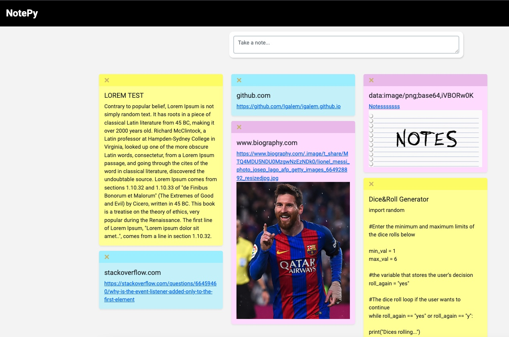
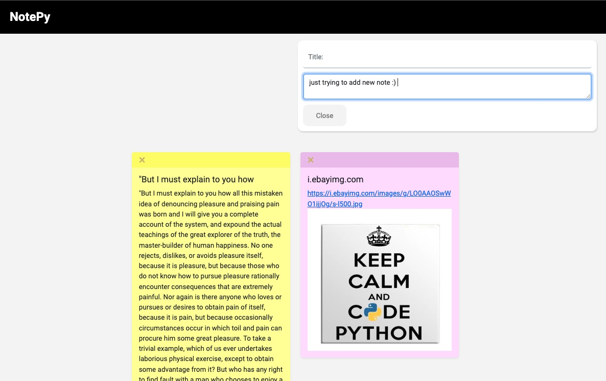
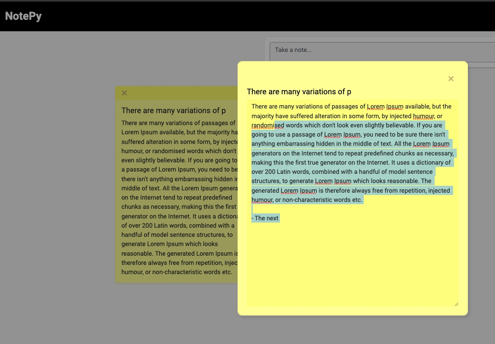

# NotePy 📍
NOTES web application based on Pyscript, Html & CSS.
 

<a href="https://igalem.github.io/notepy" target="_blank">Visit NotePy here!</a>

  
  
  
  

  
  
  

# What is NotePY ?
NotePy is a Notes web application based on pyscript, html & css.

✅ Taking notes is now fastes then ever! :) 

✅ Just "Copy & Paste" any text (Simple text / URL / Image URL / Other) and you are ready to go!

✅ Editable notes body / URLs / Descriptions and more

✅ Colorful Notes according the type on your note [standard / URL / Image]

# Enjoy! 
